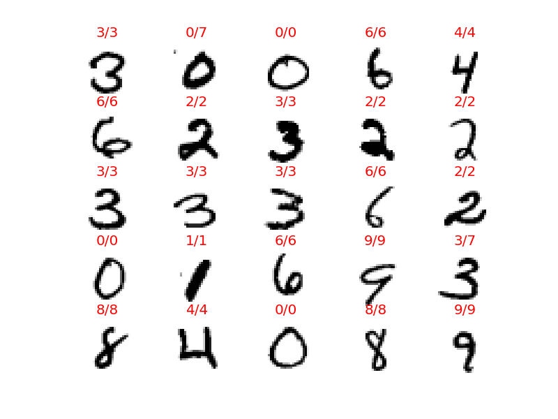

# MNIST
## SVM, Gaussian Kernel (RBF)
### Training 1
* number of features: 28x28 = 784
* number of training sets: 6000
* number of test sets: 64000
* 3 fold cross validation
* Grid Search
  * C: 8 patterns
  * Gamma: 4 patterns
* Training Results
  * Fitting 3 folds for each of 32 candidates, totalling 96 fits
  * Time of training = 900sec (15min)
  * Best Score=0.934666666667
  * Best Parm={'kernel': 'rbf', 'C': 100, 'gamma': 0.001}
* Test Results
  * Accuracy=0.93946875

### Training 2
* number of features: 28x28 = 784
* number of training sets: 8000
* number of test sets: 62000
* 3 fold cross validation
* Grid Search
  * C: 16 patterns
  * Gamma: 16 patterns
* Training Results
  * Fitting 3 folds for each of 256 candidates, totalling 768 fits
  * Time of training = 6706sec (111min)
  * Best Score=0.934625
  * Best Parm={'kernel': 'rbf', 'C': 13.593563908785255, 'gamma': 0.00085769589859089463}
* Test Results
  * Accuracy=0.943725806452

Actual Value/[Prediction]

