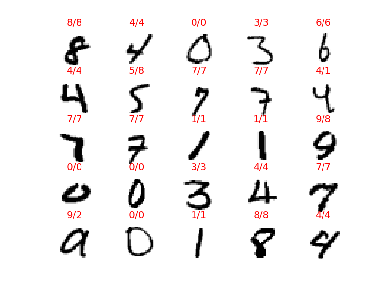
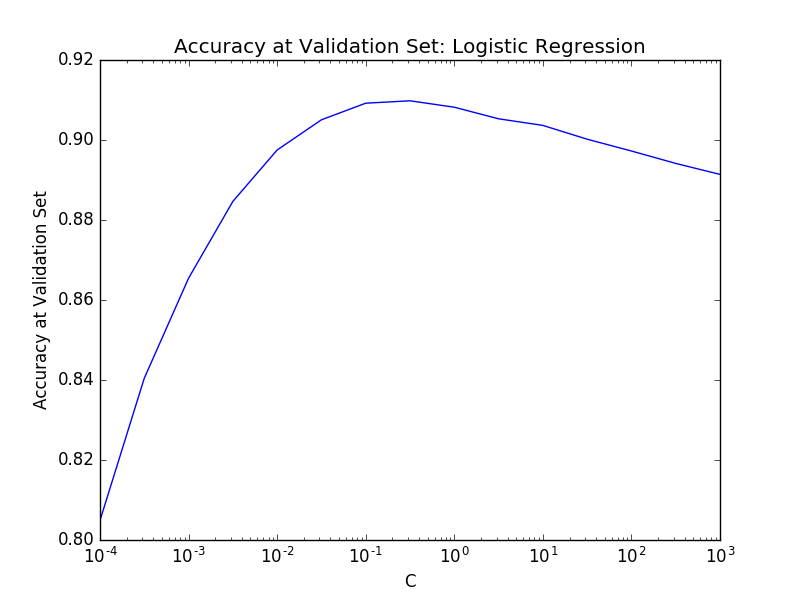

Copyright (C) 2016 Daisuke Hashimoto. All Rights Reserved.
# MNIST
## Summary
* Neural Network (3 layer)
  * time = 11min(GPU) / 124min(CPU)
  * Error Rate = 0.043714285714000045
* SVM Gaussian Kernel (RBF) (Batch Analysis)
  * time = 81min
  * Error Rate = 0.0575967741935
* SVM Linear Kernel (Batch Analysis)
  * time = 3.7min
  * Error Rate = 0.114516129032
* SVM Linear Kernel (Stochastic Gradient Descent)
  * time = 3.2min
  * Error Rate = 0.0879285714286
* Logistic Regression (Batch Analysis)
  * time = 18min
  * Error Rate = 0.113532258065

## 3-layer Neural Network (Tensor Flow)
### Lerning Condition
* number of features: 28x28 = 784
* number of training sets: 42000
* number of training sets: 14000
* number of test sets: 14000
* number of hidden node: 1024
* Grid Search
  * Learning Rate: 3 patterns
  * Lambda: 6 patterns

### Results
* Validation Results
  * Time of training(GPU) = 633sec (11min)
  * Time of training(CPU) = 7416sec (124min)
  * Best Score=0.962357142857
  * Best Parm={'alpha':1.0,	'lambda':0.001}
* Test Results
  * Accuracy=0.956285714286
  * Error Rate=0.043714285714000045

## SVM Gaussian Kernel (RBF) (Batch Analysis)
### Lerning Condition
* number of features: 28x28 = 784
* number of training sets: 8000
* number of test sets: 62000
* 3 fold cross validation
* Grid Search
  * C: 15 patterns
  * Gamma: 7 patterns

### Results
* Training Results
  * Fitting 3 folds for each of 105 candidates, totalling 315 fits
  * Time of training = 4854sec (81min)
  * Best Score=0.935375
  * Best Parm={'kernel': 'rbf', 'C': 3.1622776601683791, 'gamma': 0.001}
* Test Results
  * Accuracy=0.942403225806
  * Error Rate=0.0575967741935

Actual Value/Prediction

## SVM Linear Kernel (Batch Analysis)
### Lerning Condition
* number of features: 28x28 = 784
* number of training sets: 8000
* number of test sets: 62000
* 3 fold cross validation
* Grid Search
  * C: 15 patterns

### Results
* Training Results
  * Fitting 3 folds for each of 15 candidates, totalling 45 fits
  * Time of training = 220sec (3.7min)
  * Best Score=0.878625
  * Best Parm={'C': 0.0031622776601683794}
* Test Results
  * Accuracy=0.885483870968
  * Error Rate=0.114516129032

Actual Value/Prediction

## SVM Linear Kernel (Stochastic Gradient Descent)
### Lerning Condition
* number of features: 28x28 = 784
* number of training sets: 56000
* number of test sets: 14000
* 3 fold cross validation
* Grid Search
  * C: 15 patterns

### Results
* Training Results
  * Fitting 3 folds for each of 15 candidates, totalling 45 fits
  * Time of training = 193sec (3.2min)
  * Best Score=0.914125
  * Best Parm={'alpha': 3.1622776601683795e-05, 'n_iter': 20}
* Test Results
  * Accuracy=0.912071428571
  * Error Rate=0.0879285714286

Actual Value/Prediction

## Logistic Regression (Batch Analysis)
### Lerning Condition
* number of features: 28x28 = 784
* number of training sets: 8000
* number of test sets: 62000
* 3 fold cross validation
* Grid Search
  * C: 15 patterns

### Results
* Training Results
  * Fitting 3 folds for each of 15 candidates, totalling 45 fits
  * Time of training = 1082sec (18min)
  * Best Score=0.880125
  * Best Parm={'C': 0.10000000000000001}
* Test Results
  * Accuracy=0.886467741935
  * Error Rate=0.113532258065

Actual Value/Prediction

