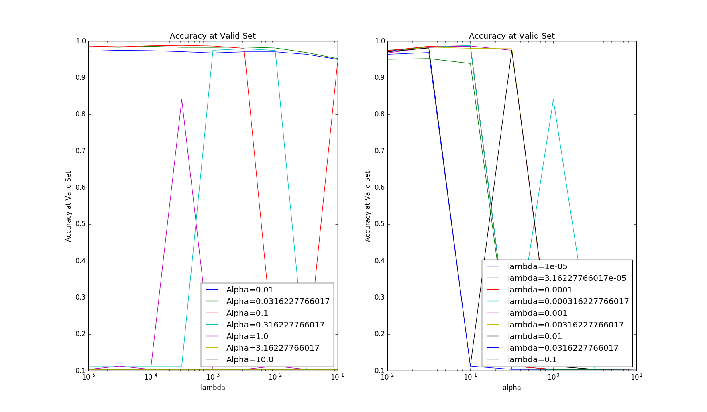
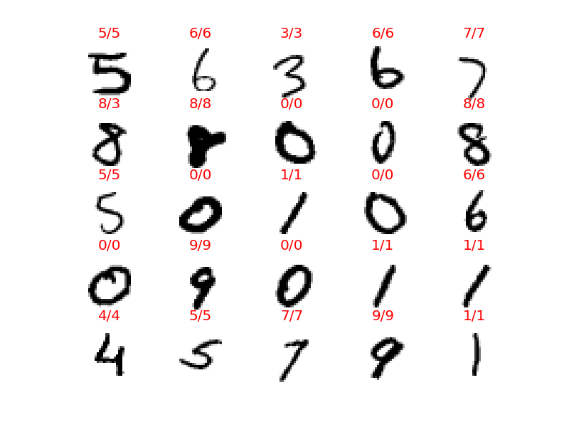
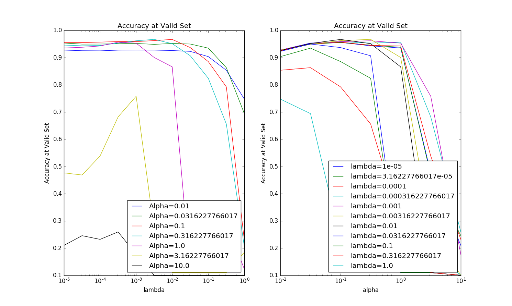
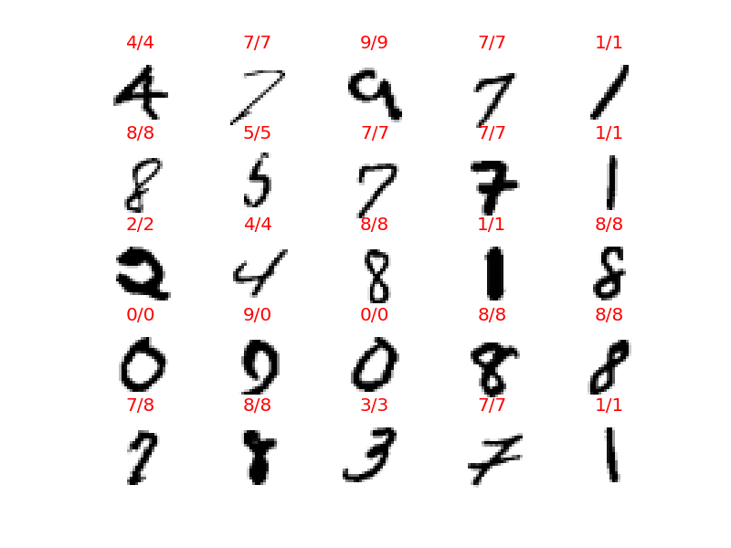
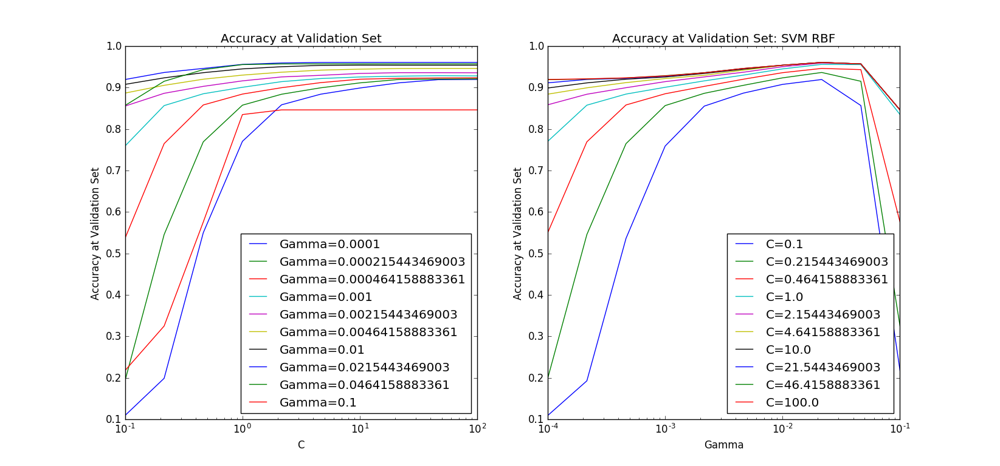

Copyright (C) 2016 Daisuke Hashimoto. All Rights Reserved.
# MNIST
## Summary
* Convolutional Neural Network (LeNet-5)
  * time = 32min (GPU)
  * Test Error Rate = 0.0193571428571
* Neural Network (3 layer)
  * time = 48min (GPU)
  * Test Error Rate = 0.0356428571429
* SVM Gaussian Kernel (RBF) (Batch Analysis)
  * time = 262min
  * Test Error Rate = 0.0851666666667
* SVM Linear Kernel (Batch Analysis)
  * time = 2.0min
  * Test Error Rate = 0.131366666667
* SVM Linear Kernel (Stochastic Gradient Descent)
  * time = 2.6min
  * Test Error Rate = 0.105357142857
* Logistic Regression (Batch Analysis)
  * time = 5.9min
  * Test Error Rate = 0.107933333333

## Convolutional Neural Network: LeNet-5 (Tensor Flow)
### Lerning Condition
* number of features: 28x28 = 784
* number of training sets: 42000
* number of training sets: 14000
* number of test sets: 14000
* dropout: 0.5
* Grid Search
  * Learning Rate: 7 patterns

### Results
* Validation Results
  * Time of training(GPU) = 1915sec (32min)
  * Best Score=0.981142857143
  * Best Parm={'alpha':0.1}
* Test Results
  * Accuracy=0.980642857143
  * Error Rate=0.0193571428571

Actual Value/Prediction

## 3-layer Neural Network (Tensor Flow)
### Lerning Condition
* number of features: 28x28 = 784
* number of training sets: 42000
* number of training sets: 14000
* number of test sets: 14000
* number of hidden node: 1024
* dropout: 0.5
* Grid Search
  * Learning Rate: 7 patterns
  * Lambda: 11 patterns

### Results
* Validation Results
  * Time of training(GPU) = 2908sec (48min)
  * Best Score=0.965928571429
  * Best Parm={'alpha':0.1,	'lambda':0.01}
* Test Results
  * Accuracy=0.964357142857
  * Error Rate=0.0356428571429

Actual Value/Prediction

## SVM Gaussian Kernel (RBF) (Batch Analysis)
### Lerning Condition
* number of features: 28x28 = 784
* number of training sets: 20000
* number of validation sets: 20000
* number of test sets: 30000
* Grid Search
  * C: 15 patterns
  * Gamma: 7 patterns

### Results
* Training Results
  * Time of training = 15723sec (262min)
  * Best Score=0.97475
  * Best Parm={'kernel': 'rbf', 'C': 3.16227766017, 'gamma': }
* Test Results
  * Accuracy=0.914833333333
  * Error Rate=0.0851666666667

Actual Value/Prediction

## SVM Linear Kernel (Batch Analysis)
### Lerning Condition
* number of features: 28x28 = 784
* number of training sets: 20000
* number of validation sets: 20000
* number of test sets: 30000
* Grid Search
  * C: 15 patterns

### Results
* Validation Results
  * Time of training = 118sec (2.0min)
  * Best Score=0.91225
  * Best Parm={'C': 0.01}
* Test Results
  * Accuracy=0.868633333333
  * Error Rate=0.131366666667

Actual Value/Prediction

## SVM Linear Kernel (Stochastic Gradient Descent)
### Lerning Condition
* number of features: 28x28 = 784
* number of training sets: 42000
* number of validation sets: 14000
* number of test sets: 14000
* Grid Search
  * C: 15 patterns

### Results
* Training Results
  * Time of training = 154sec (2.6min)
  * Best Score=0.915571428571
  * Best Parm={'C': 3162.27766017}
* Test Results
  * Accuracy=0.894642857143
  * Error Rate=0.105357142857

Actual Value/Prediction

## Logistic Regression (Batch Analysis)
### Lerning Condition
* number of features: 28x28 = 784
* number of training sets: 20000
* number of validation sets: 20000
* number of test sets: 30000
* Grid Search
  * C: 15 patterns

### Results
* Training Results
  * Time of training = 356sec (5.9min)
* Validation Results
  * Best Score=0.9098
  * Best Parm={'C': 0.316227766017}
* Test Results
  * Accuracy=0.892066666667
  * Error Rate=0.107933333333

Actual Value/Prediction

