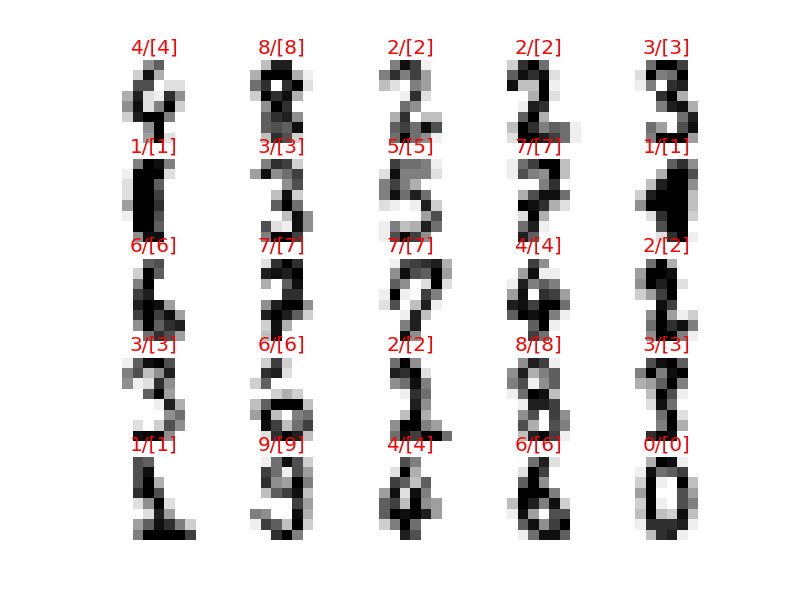

Copyright (C) 2016 Daisuke Hashimoto. All Rights Reserved.
# sklearn.datasets.load_digits()
* number of data sets: 1797
* number of features: 8x8=64
* 10 fold cross validation
* SVM with Gaussian Kernel
* Grid Search
  * C: 10 patterns
  * Gamma: 8 patterns
* Accuracy = 0.982192543127 (SVM Gaussian Kernel)
* Error Rate = 0.017807456873 (SVM Gaussian Kernel)

## Time of processing
* GridSearch (Scratch)
  * Single Process: 219sec
  * Multi Process: 75sec
* GridSearch (GridSearchCV)
  * Multi Process: 70sec

# Example of prediction
Actual Value/Prediction

