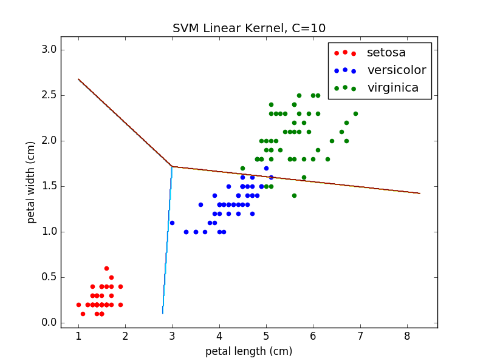
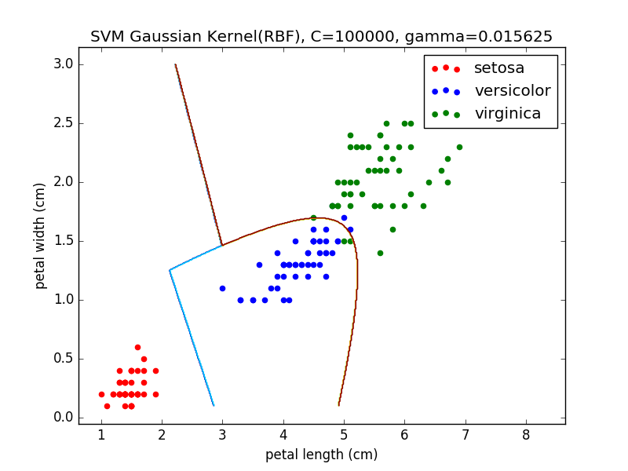
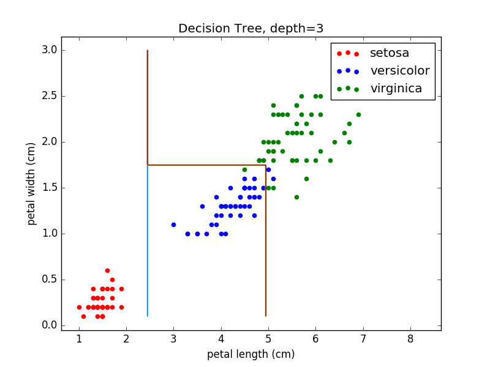

Copyright (C) 2016 Daisuke Hashimoto. All Rights Reserved.
# sklearn.datasets.load_iris()
* number of data sets: 150
* number of features: 2
* 10 fold cross validation
* Grid Search

## Result
* SVM with Linear Kernel
  * C: 10 patterns
  * Time = 0.3sec
  * Accuracy = 0.926666666667
* SVM with Gaussian Kernel (RBF)
  * C: 10 patterns
  * Gamma: 8 patterns
  * Time = 1.0sec
  * Accuracy = 0.959407091141
* Binary Decision Tree
  * Max Depth: 20 patterns
  * Time = 0.3sec
  * Accuracy = 0.94

